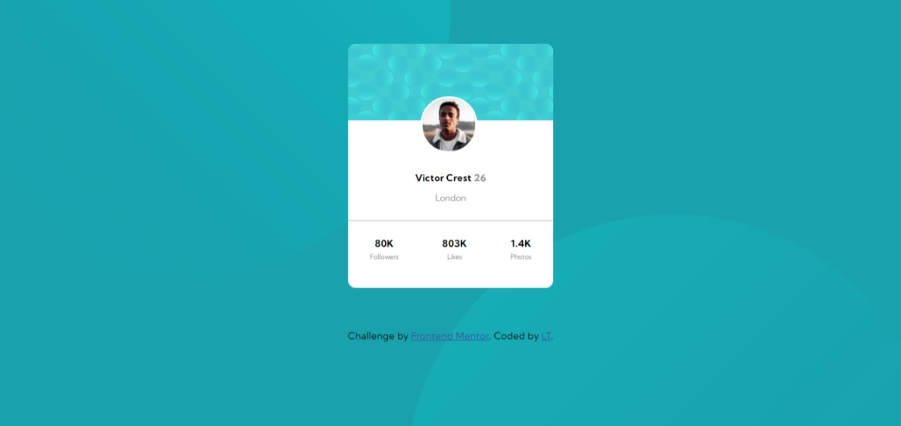

# Frontend Mentor - Profile card component

## Welcome! 👋

Thanks for checking out my front-end coding challenge solution from **Frontend Mentor**.

## Table of contents

- [Overview](#overview)
  - [The challenge](#the-challenge)
  - [Screenshot](#screenshot)
  - [Links](#links)
- [My process](#my-process)
  - [Built with](#built-with)
  - [What I learned](#what-i-learned)
  - [Continued development](#continued-development)
  - [Useful resources](#useful-resources)
- [Author](#author)
- [Acknowledgments](#acknowledgments)

## Overview

### The challenge

- Build out the project to the designs provided

### Screenshot

### Links

- Solution URL: [Add solution URL here](https://your-solution-url.com)
- Live Site URL: [Add live site URL here](https://your-live-site-url.com)

## My process

### Built with

- Semantic HTML5 markup
- CSS custom properties
- Flexbox
- Mobile-first workflow

### What I learned

This is my third Frontend Mentor challenge, and the challenge took me less time than my first two challenges, that is probaly progress, however the design was also simple to implement, well after doing the two background images.

I learned how to add two background images to a page. I first had to check on YouTube how this can be done, as I've rarely worked with background images. I found helpful content from Kevin Powell - I'll share the link at the bottom of the file.

**My approach**
- Build the mock-up with the mobile-design approach.
- Markout sections on the design that will be broken down into my HTML Markup
- Setup basic styles to be used for my typography.

**My challenges**
- Adding two background images was the biggest challenge.

**Final takeaway**
- The challenge was good - I loved it, it really was simple to implement after adding the background images.
- I'm happy on the outcome - there is always room for improvement and I undertake to check other peoples solutions and see how they approached doing this challenge.

### Continued development

- Accessibility
- Media queries 
- CSS Properties: vw, vh etc.

### Useful resources

- [Kevin Powell - Controlling background-images | CSS Tutorial](https://www.youtube.com/watch?v=3T_Jy1CqH9k) - This helped me with adding two background images and exposed me more to CSS properties for styling background images. I really liked this tutorial and will always use it as a reference going forward.

## Author

- Frontend Mentor - [@LT-WebDev](https://www.frontendmentor.io/profile/LT-WebDev)
- Twitter - [@IAM_letlotlo_](https://www.twitter.com/IAM_letlotlo_)

